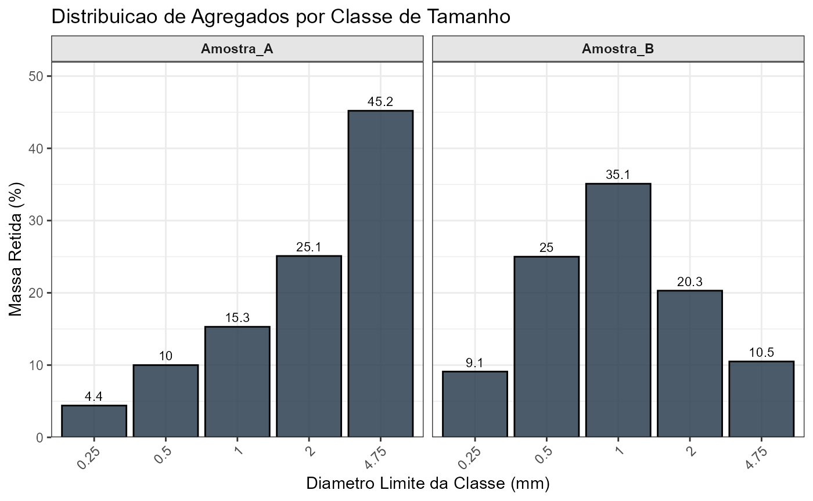
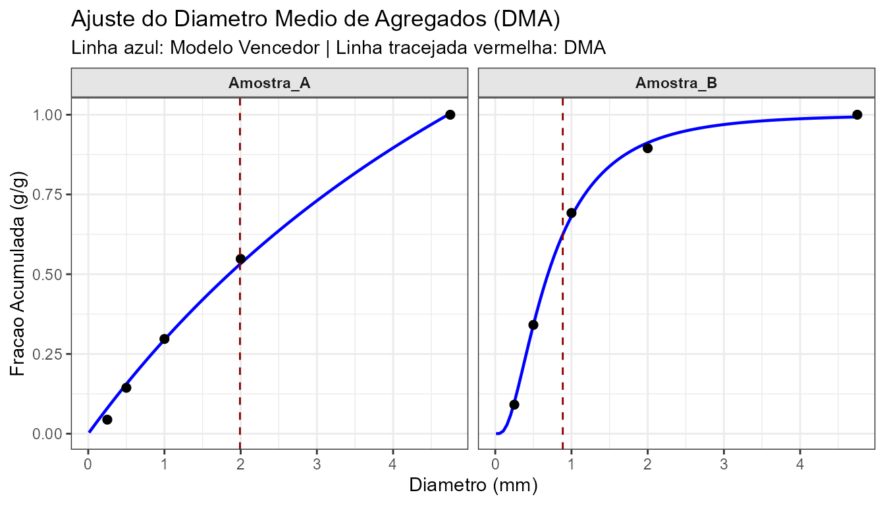

# Primeiros Passos com SoilAggregatesMD

O pacote **`SoilAggregatesMD`** foi desenvolvido para automatizar o
cálculo e a análise da distribuição de agregados do solo. O seu foco
principal é a obtenção rápida e precisa do **Diâmetro Médio Ajustado
(DMA)**, conforme proposto por van Lier & Albuquerque (1997), testando
automaticamente múltiplos modelos não-lineares.

Neste tutorial rápido, vamos mostrar como realizar uma análise completa
de peneiramento a partir de dados brutos.

## 1. Carregando o pacote e preparando os dados

Primeiro, carregamos o pacote. Para este exemplo, vamos criar um pequeno
conjunto de dados simulando duas amostras de solo submetidas a
peneiramento.

``` r
library(SoilAggregatesMD)

# Simulando dados de peneiramento para duas amostras
dados_exemplo <- data.frame(
  amostra_id = rep(c("Amostra_A", "Amostra_B"), each = 5),
  diametro_mm = rep(c(4.75, 2.00, 1.00, 0.50, 0.25), times = 2),
  massa_g = c(
    # Massa retida (g) para Amostra A (mais agregada)
    45.2, 25.1, 15.3, 10.0, 4.4,
    # Massa retida (g) para Amostra B (mais desagregada)
    10.5, 20.3, 35.1, 25.0, 9.1
  )
)

head(dados_exemplo)
#>   amostra_id diametro_mm massa_g
#> 1  Amostra_A        4.75    45.2
#> 2  Amostra_A        2.00    25.1
#> 3  Amostra_A        1.00    15.3
#> 4  Amostra_A        0.50    10.0
#> 5  Amostra_A        0.25     4.4
#> 6  Amostra_B        4.75    10.5
```

## 2. A Análise Completa

A função principal do pacote é a
[`analise_completa_dma()`](../reference/analise_completa_dma.md). Ela
faz todo o trabalho pesado: 1. Processa as frações de massa e diâmetros.
2. Calcula os índices tradicionais (DMP e DMG). 3. Testa 7 modelos
matemáticos diferentes para a curva de retenção. 4. Seleciona o modelo
com o maior $`R^2`$ e calcula o DMA.

``` r
resultados <- analise_completa_dma(
  dados = dados_exemplo, 
  col_amostra = "amostra_id", 
  col_diametro = "diametro_mm", 
  col_massa = "massa_g"
)

# Visualizando o resumo com o modelo vencedor e o DMA calculado
resultados$resumo
#> # A tibble: 2 × 9
#>   amostra_id   DMP   DMG   DMA Modelo_Vencedor R2_Melhor Param_a Param_b
#>   <chr>      <dbl> <dbl> <dbl> <chr>               <dbl>   <dbl>   <dbl>
#> 1 Amostra_A   2.06 1.52  1.99  Eq3                 0.997   0.357   3.04 
#> 2 Amostra_B   1.03 0.722 0.886 LogNormal           0.999  -0.371   0.786
#> # ℹ 1 more variable: Uso_Recomendado <chr>
```

## 3. Diagnósticos Visuais

Com os resultados em mãos, o pacote oferece funções prontas para a
visualização dos dados.

Podemos visualizar a distribuição percentual da massa retida em cada
classe de diâmetro:

``` r
# O objeto df_processado é gerado internamente, mas podemos extraí-lo com prep_agregados
prep <- prep_agregados(dados_exemplo)

plot_distribuicao_agregados(prep$dados_processados)
```



E, mais importante, podemos visualizar o ajuste das curvas dos modelos
vencedores e onde o DMA se posiciona graficamente para cada amostra:

``` r
plot_dma(
  df_processado = prep$dados_processados, 
  df_dma = resultados$resumo
)
```



## 4. Exportando Resultados

Para integrar o `SoilAggregatesMD` ao seu fluxo de trabalho, você pode
exportar a lista de resultados gerada diretamente para uma planilha do
Excel usando a função
[`exportar_analise_xlsx()`](../reference/exportar_analise_xlsx.md):

``` r
# Salva um arquivo .xlsx no seu diretório de trabalho atual
exportar_analise_xlsx(resultados, "meus_resultados_agregados.xlsx")
```
